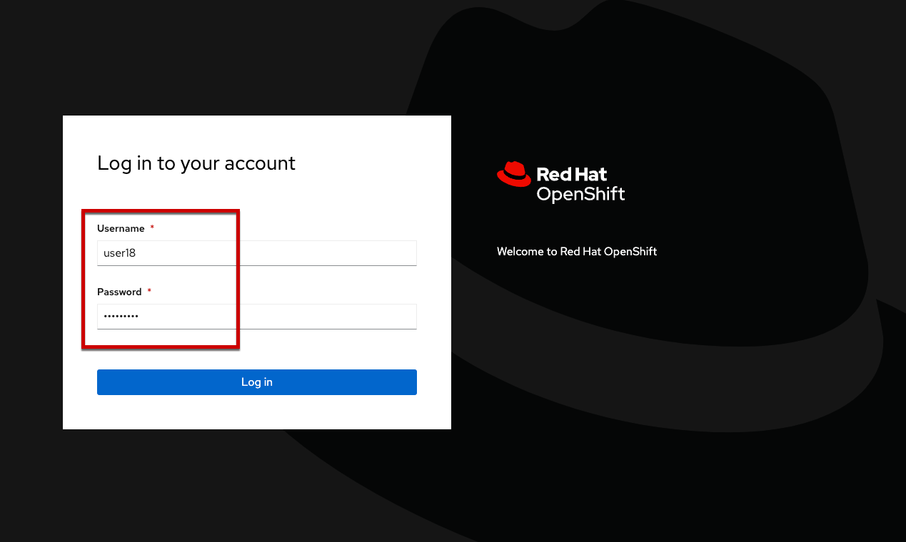

= Getting started

During this lab we will spend some time getting familiar with the aspects of OpenShift that are relevant to virtual machines, create a virtual machine, import a virtual machine, and manage various aspects of virtual machines in Kubernetes.

[IMPORTANT]
**If, at any time, you have a question or issue please do not hesitate to get the attention of a lab proctor to assist.**

== The OpenShift Console

This lab environment utilizes the Bookbag interface for presenting an interactive lab guide. **We recommend that you open the OpenShift console in a separate browser window.**

The OpenShift console is the primary GUI-based interface used by administrators and developers to access, manage, and configure the resources deployed to OpenShift. The console can be opened using https://console-openshift-console.%cluster_subdomain%[this link] or browsing to https://console-openshift-console.%cluster_subdomain%

To login to the console:

* Open link:https://console-openshift-console.%cluster_subdomain%[this link], or copy/paste this url: https://console-openshift-console.%cluster_subdomain%, in a new tab or window
* Use the credentials below
+
----
username: %username%
password: openshift
----
+

Once you have successfully logged into the OpenShift administrator console, please continue to the next segment of the lab.

== The bookbag interface

While progressing through the lab, you'll be able to _copy_ code and commands to be used in the OpenShift console. The commands to be copied will be indicated using the copy symbol, when you hover over the code:

## Conventions
You will see various code and command blocks throughout these exercises. Some of
the command blocks can be executed directly. Others will require modification
of the command before execution. If you see a command block with a red border
(see below), the command will copy to clipboard for slight required modification.

The icon beside the command blocks should tell you if the commands will be executed or copied.

- This command block will be copied to your clipboard for modification.

[source,none,role="copypaste copypaste-warning"]
----
some command to modify
----
[Note]
====
To paste the copied command try the following

- Cmd + V _tested to work in Chrome on macOS_
- Ctrl + Shift + V _tested to work in Chrome and Firefox on Windows 10_
- Right click + paste in the terminal window _tested to work on Edge on Windows 10_
====

If at any time a glitch occurs and the workshop content does not display properly because of a network issue, and an error is displayed, or it shows as a white page, select the drop-down menu at the top right corner, above the terminals and select "**Reload Workshop**". That menu item will reload just the workshop content and leave you on the same page.

Where possible, don't refresh the browser window as you will be reverted back to the welcome page (it will not remove any progress that you've made) - you will need to navigate back to where you were. If you have any issues which using the reload menu items do not solve, please ask for help!