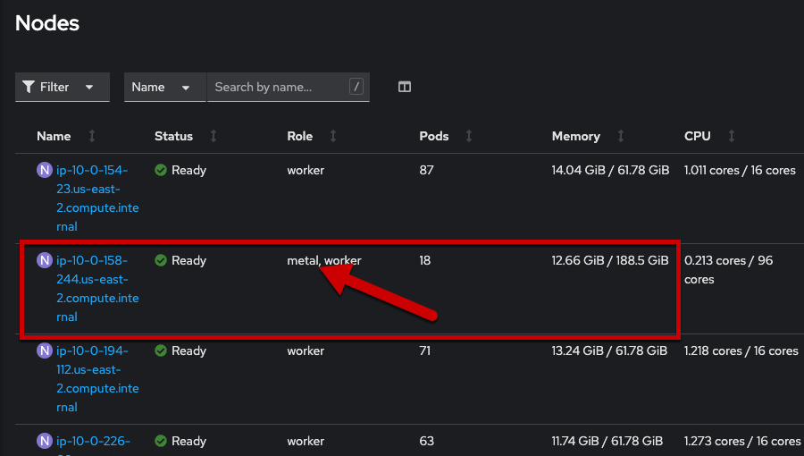
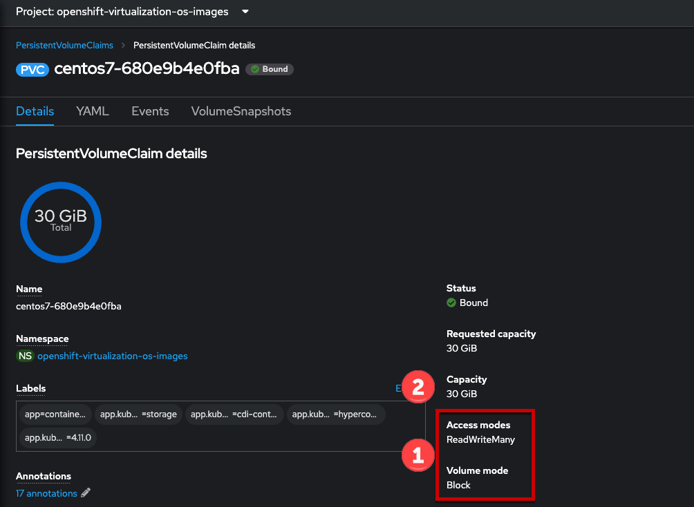

:scrollbar:
:toc2:

== Environment Review and OpenShift Virtualization Operator Installation

:numbered:

== Introduction to the OpenShift Virtualization Operator

In this lab, we will review the OpenShift Operator that installs Red Hat^(R)^ OpenShift^(R)^ Virtualization for Red Hat OpenShift.

.Goals
* Become familiar with the cluster requirements for Red Hat OpenShift Virtualization
* Explore the nodes and machines in your Red Hat OpenShift Container Platform cluster
* Examine the installed Operator and the PersistentVolumeClaim created by the Operator

== Review Red Hat OpenShift Container Platform Cluster

=== Supported Platforms

* Today OpenShift Virtualization is only supported with self-managed bare metal servers on-premises or at a simliar location.

* Amazon Web Services (AWS) bare metal instances are tech preview. See link:https://access.redhat.com/articles/6409731[Deploy OpenShift Virtualization on AWS Bare Metal Nodes for details]. The lab you're using today is an OpenShift cluster deployed to AWS using a metal instance type.

* IBM Cloud Bare Metal Servers are tech preview. See link:https://access.redhat.com/articles/6738731[Deploy OpenShift Virtualization on IBM Cloud Bare Metal Nodes for details].

[NOTE]
Installing OpenShift Virtualization on AWS bare metal instances or on IBM Cloud Bare Metal Servers is a Technology Preview feature only. Technology Preview features are not supported with Red Hat production service level agreements (SLAs) and might not be functionally complete. Red Hat does not recommend using them in production. These features provide early access to upcoming product features, enabling customers to test functionality and provide feedback during the development process.

=== Requirements for OpenShift Virtualization

Before you install OpenShift Virtualization for Red Hat OpenShift Container, make sure that your Red Hat OpenShift Container Platform cluster meets the following requirements.

* CPU requirements
** Supported by Red Hat Enterprise Linux (RHEL) 8
** Support for Intel 64 or AMD64 CPU extensions
** Intel VT or AMD-V hardware virtualization extensions enabled
** NX (no execute) flag enabled

* Storage requirements
** Supported by OpenShift
** A CSI provisioner is strongly encouraged
** `ReadWriteMany` (RWX) PVCs are required for live migration
** A CSI provisioner that supports accelerated volume creation via CSI clones or snapshots makes creating VMs from templates much faster. If one is not available, OpenShift Virtualization will fallback to using a host copy.

* OpenShift cluster node requirements
** Red Hat Enterprise Linux CoreOS (RHCOS) installed on worker nodes
** CPU, memory, and network capacity sufficient to host your virtual machine workload.

Review https://docs.openshift.com/container-platform/4.12/virt/install/preparing-cluster-for-virt.html[the documentation] for specific requirements and guidance on hardware for OpenShift Virtualization.

[NOTE]
If your cluster uses worker nodes with different CPUs, live migration failures can occur because different CPUs have different capabilities. 

=== Review Nodes and Machines

. Navigate to https://console-openshift-console.%cluster_subdomain% and login with user `%username%` and password `openshift`.

. From the navigation menu, select *Compute* -> *Nodes*:
+

+
There are three control plane and multiple workers, including several "metal" nodes, in the cluster. At least one physical node is required for OpenShift Virtualization, "nesting" and emulation are not supported. However, other nodes in the cluster can be virtual machines, for example control plane and infrastructure nodes.
+
[NOTE]
**Reminder:** OpenShift Virtualization using AWS bare metal nodes is currently tech preview.

. Click a `metal` worker node to see detailed resource information about the node. Navigate to the *Details* tab to review the information about the node, including the operating system and CPU architecture.
+

+
The bare-metal node is configured using RHCOS with a CPU using the `amd64` architecture. Both of these are supported by OpenShift Virtualization.
+

. Select the *YAML* tab for the metal node:
+

+
The labels for `*.node.kubevirt.io` indicate which features are supported by this node, including CPU features/capabilities and other low-level hardware functionality. These labels, along with the node's annotations, can be used for scheduling hints with virtual machines. For example, if your cluster consists of nodes with mixed AMD and Intel CPU architectures node selectors can be used to indicate that you want the VM to use one or the other.
+

+
Scroll further down in the node's YAML details to the `status.allocatable` stanza. The values here indicate what special hardware types are available to be used by VMs and other Pods. If the node had one or more GPUs, large/huge pages, or other devices such as SR-IOV / DPDK networking devices they would show up in this section as being available.

== The OpenShift Virtualization Operator

Due to the time constraints of the session, the OpenShift Virtualization Operator has been preinstalled for you. You can navigate to *Operators* -> *Installed Operators* to get the list of the operators installed. Ensure *All Projects* is selected to list Operators across all namespaces and type `virtualization` in the search box to filter the list.

For this lab we'll be focusing on two Operators: OpenShift Virtualization and the Migration Toolkit for Virtualization.

=== Examine the OpenShift Virtualization Operator

. Click on *OpenShift Virtualization* from the operator installed list.

. Click the *Details* tab to view information about the Operator:
+

+
The Operator provides two custom resource definitions (CRDs) to extend the Kubernetes API: the OpenShift Virtualization deployment and the Host Path Provisioner. Installing the Operator is only the first step to deploying OpenShift Virtualization, an instance of the OpenShift Virtualization Deployment must also be created.

. Click the *OpenShift Virtualization Deployment* tab, then click the *Create HyperConverged* button:
+

+
[NOTE]
OpenShift Virtuailzation, even when deployed to a cluster with OpenShift Data Foundation or another Kubernetes-native storage solution, is not a hyperconverged product, which makes the Kubernetes object name misleading. This naming is the result of the history of the upstream KubeVirt project and it's origins as a part of the "Kubernetes-native Infrastructure" meta-project.

. Explore the configuration options for OpenShift Virtualization
+
This screen represents global configuration options for OpenShift Virtualization and can be used to enable/disable features of OpenShift Virtualization and VM capabilities. For example, scroll down then expand the menu item for *featureGates*. The *withHostPassthroughCPU* option is not enabled by default, however if you wanted to allow virtual machines to inhert the exact CPU features and capabilities of the physical node it's being hosted on then you would need to check this box.
+

+
*IMPORTANT:* Do not click *Create* at the bottom of the form. This is unnecessary, OpenShift Virtualization has already been deployed to the lab cluster.

=== Examine `PersistentVolumeClaims` created by the Operator

Persistent virtual machines require persistent storage. This lab environmet has OpenShift Data Foundation deployed to provide access to shared persistent volumes to host application data, both for containers and virtual machines. During the installation of the OpenShift Virtualization Operator, some `PersistentVolumeClaims` were automatically created to hold template disks for for various Linux distributions. These include:

* Red Hat Enterprise Linux 8.0+
* Red Hat Enterprise Linux 9.0
* Fedora
* CentOS 7
* CentOS Stream 8
* CentOS Stream 9

Using these OS images is optional and the creation + download can be disabled by via the appropriate setting on the CRD (see the previous section). However, they are a quick and convenient way to get started provisioning virtual machines with OpenShift Virtualization since they use the "cloud" image for each of the respective distributions. This image includes cloud-init and often is a reduced OS footprint optimized for virtualization.

In this section, we will examine the PVCs created by the Operator.

. In the left menu, navigate to *Storage* and click *PersistentVolumeClaims*. From the project dropdown select `Show default projects` and filter or select `openshift-virtualization-os-images`
+

. Select one of the PVCs, click the name to see the detailed overview
+
Each of the PVCs will come from the `ocs-storagecluster-ceph-rbd` storage class, provided by OpenShift Data Foundation. The details of the PVC show that it is a `ReadWriteMany` PVC, which is required for live migration, and is using `block` mode. The mode can be `block` or `file`, depending on the vendor, and either will work so long as `RWX` mode is available.
+
The capacity should be large enough to hold the base operating system and any packages/software installed that will be used by any VMs created from this template disk. VMs created from the disk can increase the size of the disk, but cannot shrink it.
+

+
These PVCs contain the template disks for virtual machines. They were created automatically by the Operator when it was deployed, importing the disks from Red Hat sources. As the virtualization administrator, you can disable this behavior and have the ability to create and add your own template disks, including those for Microsoft Windows operating systems.

Now that we have an understanding of some of hte basics of the OpenShift environment and OpenShift Virtualization configuration, let's move on to creating a virtual machine.