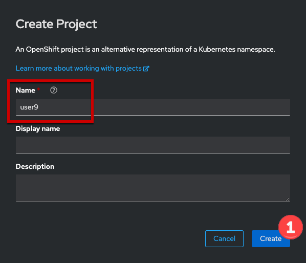
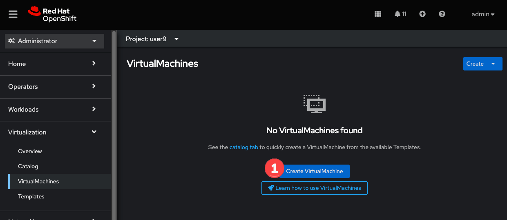
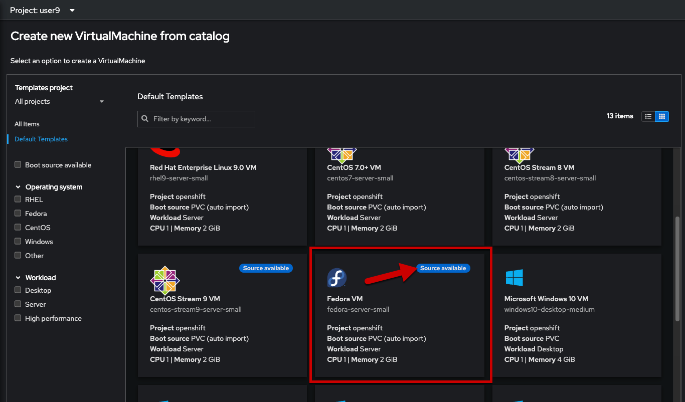
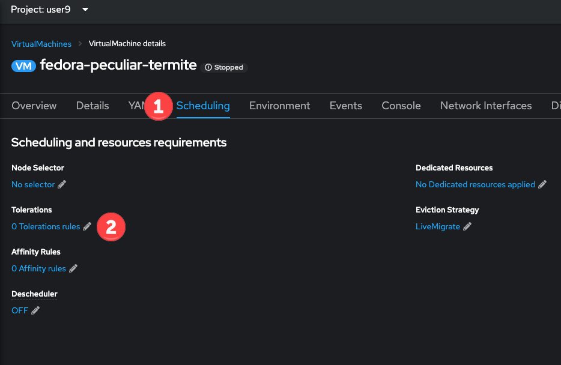
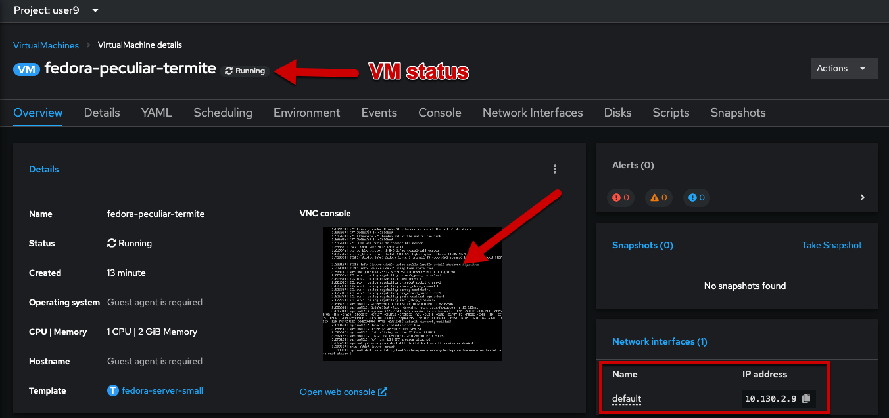

:scrollbar:
:toc2:

= Virtual machine creation and administration

:numbered:

== Introduction

In this segment we will explore how to use the OpenShift console to create a new virtual machine using a template. For this lab the templates are automatically generated by the Operator when it's deployed. A connected OpenShift cluster with a default storage class will, by default, automatically create the same templates, simplifying and expediting the process of getting started.

Goals of this section:

* Create a new virtual machine from a template
* Start the VM and access the console
* Become familiar with VM configuration using the OpenShift interface

[NOTE]
Before getting started, please ensure you have opened the OpenShift administrator's console in a different tab/window and have logged in with the `admin` credentials.

== OpenShift Virtualization Overview Dashboard

The overview dashboard provides a cluster-level view of virtual machines and resources used, along with status information for the health of OpenShift Virtualization and virtual machines. It is a useful starting point for administrators who want a quick and high-level view of what's happening with OpenShift Virtualization.

. From the left navigation menu, browse to *Virtualization* -> *Overview*
+

+
This overview page provides the OpenShift Virtualization administrator a global overview of the virtual machines in the cluster. 
+
[NOTE]
If the `Getting started resources` panel is shown (dismiss it if you'd like using the three-dots menu in the upper right corner of the panel), use the links there to access more information about OpenShift virtualization, including Quick Starts which provide a guided walk through of how to create a VM and upload a custom boot source for your virtual machines.
+
image::images/create_quickstarts.png[]

. Review the top consumers
+
Scrolling down on the page shows the VMs which are "top consumers" of various resources, including CPU, memory, and storage. Note that in a newly created cluster there are no consumers, so there is not much to see in the beginning.
+
image::images/create_overview_consumers_png.png[]

== Create a new virtual machine from a template

Creating virtual machines is one of the most frequently accomplished tasks for a virtualization administrator. This section will walk through the process of creating a new virtual machine using a pre-created template. As the virtualization administrator, you have the ability to create your own tempaltes that use guest operating system disks with your organization's customizations, preferred VM sizing options, and additional customization options using cloud-init or sysprep.

. From the left navigation menu, browse to *Virtualization* -> *VirtualMachines*
+

. Create a new project for your virtual machine
+
Virtual machines, like all Kubernetes and OpenShift resources, are namespaced. They are subject to the same inter-and-intra namespace restrictions as any other workload as well. Create a new project by first clicking the dropdown for *Project* in the upper left of the panel, then selecting *Create Project* at the bottom of the list.
+
image::images/create_project_menu.png[]
+
Use `rhsummit` as the name of the project, then click *Create*.
+

+
Once created, the interface will automatically move to the new `rhsummit` project. If it does not, change to that project now.

. Click *Create VirtualMachine* and select the template to use.
+

+
Reviewing the list of available templates you'll notice that some have a blue badge which indicates "Source available". These are templates which are using the automatically downloaded and stored template disks reviewed in the previous page. If you were deploying in your own environment, you have the option of removing those source disks and uploading custom disks for organization.
+
For now, let's select the *Fedora VM* card to create a new Fedora virtual machine.
+

. Create the virtual machine
+
After clicking the card, a modal will overlay the screen with some details of the virtual machine that will be created. You can opt to take all of the defaults, customizing only the name, or customize the VM as needed before creating. For this step we're going to not modify any configuration, *uncheck the box for "Start this VirtualMachine after creation"*, and choose the *Quick create VirtualMachine* option.
+

. Add a toleration to the virtual machine
+
The lab environment uses a taint on the phsical node to prevent other OpenShift workloads from running. This is not required for OpenShift Virtualization and is used only in the lab to manage workloads across the mix of physical and virtual nodes. For the newly created virtual machine to successfully schedule and run on the node, we need to add a toleration.
+
After clicking the quick create button in the last step, you will be at the virtual machine details page for the newly created virtual machine. Click the *Scheduling* tab, then the link under the *Tolerations* item.
+

+
In the modal dialog, click the *Add toleration to specify qualifying Nodes* link.
+

+
In the *Taint key* column, enter `metal`, leaving the value column empty and the effect column with the default value of `NoSchedule`. After entering the name of the taint, the dialog will change to show that there is a matching node. Click the *Save* button to close the dialog.
+

== Starting and logging into the virtual machine

With the virtual machine defined, it's time to power it on and begin using it.

. Start the virtual machine
+
After closing the toleration dialog, select the *Overview* tab. In the upper right corner of the panel, click the *Actions* drop down and choose *Start*.
+

+
After starting the VM, the status will change to `starting` followed a few seconds later by `running`. We can also see a miniature view of the VMs console and the IP address assigned to the VM on the SDN.
+

. Open the console and log into the guest operating system
+
To open the console, we can click the link labeled `Open web console`, which will result in a new window opening, or click the tab named *Console* in the OpenShift interface. For this lab, to keep the number of tabs and windows to a minimum, we will chose the *Console* tab.
+

+
[NOTE]
If your window is too small or screen resolution does not accommodate comfortable usage, clicking the "open web console" link to use a separate window is ok too.
+
This virtual machine was created from https://fedoraproject.org/cloud/[a known cloud image] with cloud-init installed. As a result, the system has automatically configured a password for the default `fedora` user. In the console window, click the link for *Guest login credentials* to view the username and password.
+

+
Using this information, click into the console window and log into the system. From here you can test out various standard Linux commands. For example using the command `lsblk` shows the VM's 30GiB primary disk and a secondary disk attached for cloud-init data.
+
