:scrollbar:
:toc2:

= Managing virtual machines

:numbered:

In this segment of the lab we will accomplish some common virtual machine management tasks via the GUI. The OpenShift administrator console plugin for OpenShift Virtualization makes the process of changing, adding, and removing VM configuration straightforward and familiar, however you can also choose to use the CLI to edit the YAML definition directly. 

Each virtual machine is an object, like all things deployed using Kubernetes, so we can interact with it using the same tools and processes as any other Kubernetes object. However, we will not be focusing on that during this lab. If you want to lean more about https://docs.openshift.com/container-platform/4.12/virt/virtual_machines/virt-create-vms.html#virt-creating-vm-cli_virt-create-vms[creating] and https://docs.openshift.com/container-platform/4.12/virt/virtual_machines/virt-edit-vms.html#virt-editing-vm-cli_virt-edit-vms[editing] virtual machines using YAML, please refer to https://docs.openshift.com/container-platform/4.12/virt/virt-using-the-cli-tools.html[the documentation].

Goals:

* Customize a VM during creation
* Manage VM snapshots

== Customizing a VM at creation

This section of the lab will focus on modifying and customizing a virtual machine during the creation process, including setting different CPU and memory values, a larger operating system disk, setting a taint for scheduling, using cloud-init to install an application, and, finally, adding a label to the virtual machine so that it can be identified like other Kubernetes objects.

. In the navigation menu, browse to *Virtualization* -> *VirtualMachines*
+
Make sure you're using the `%username%` project.
+
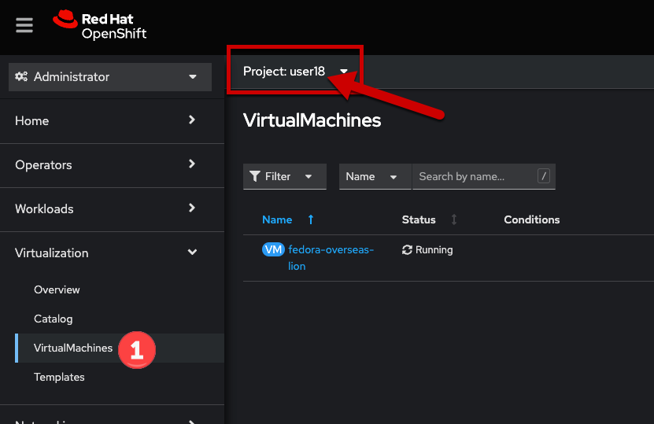

. Click the *Create* dropdown, select *From catalog*
+
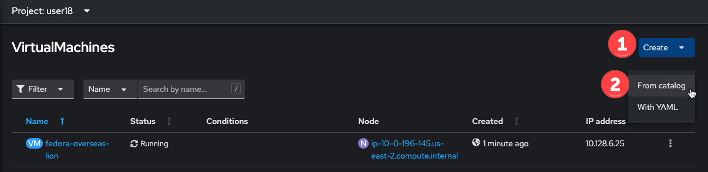

. Choose the *Fedora VM* template
+
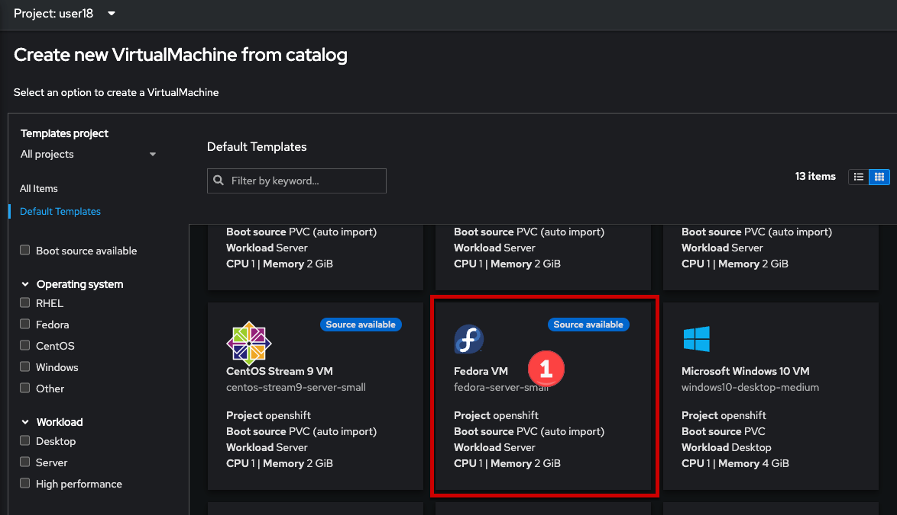

. Click *Customize VirtualMachine*
+

. Click *Review and create VirtualMachine*
+
This page asks for details on the source disk used for the virtual machine. We don't want to change the disk from what's used by default, so we can move on to modify other seetings by clicking the button.
+
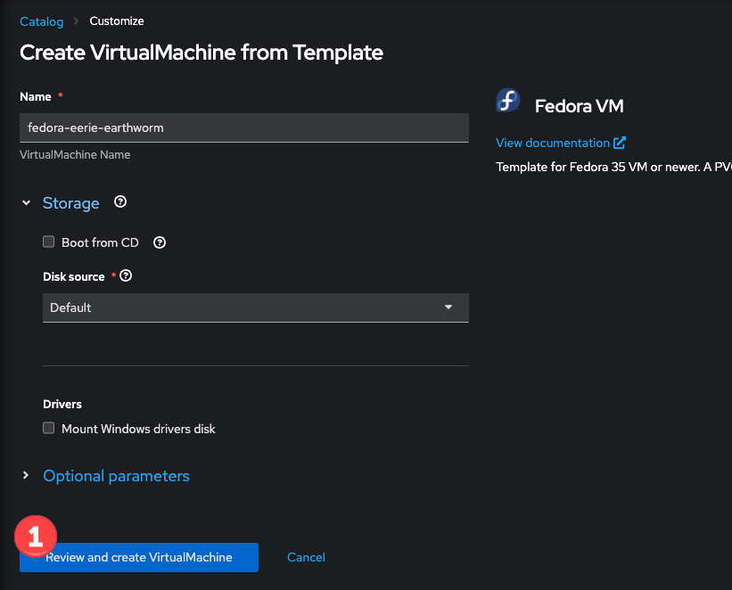

. Edit the *CPU | Memory* value
+
From the *Overview* tab there are multiple options for changing the basic configuration of the virtual machine. The template we chose uses a base of 1 vCPU and 2 GiB of memory. Let's change that to use 2 vCPU and 4 GiB of memory but clicking the link with the pencil next to it.
+
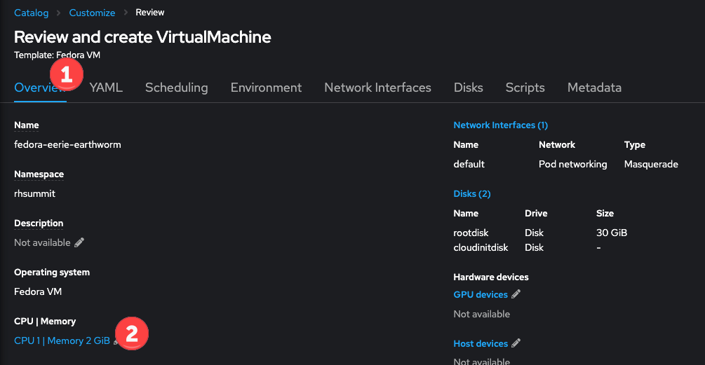
+
In the modal that appears, use the plus/minus or type new values into the CPU and memory boxes. When done, click the *Save* button.
+
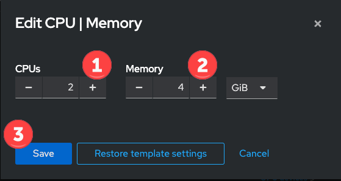

. Modify the size of the root disk
+
For this virtual machine we are going to increase the size of the OS disk. Start by moving to the *Disks* tab in the interface. For the `rootdisk`, choose the *Edit* menu option. Note that if you don’t see the 3-dot- menu, you might need to resize your browser window.
+
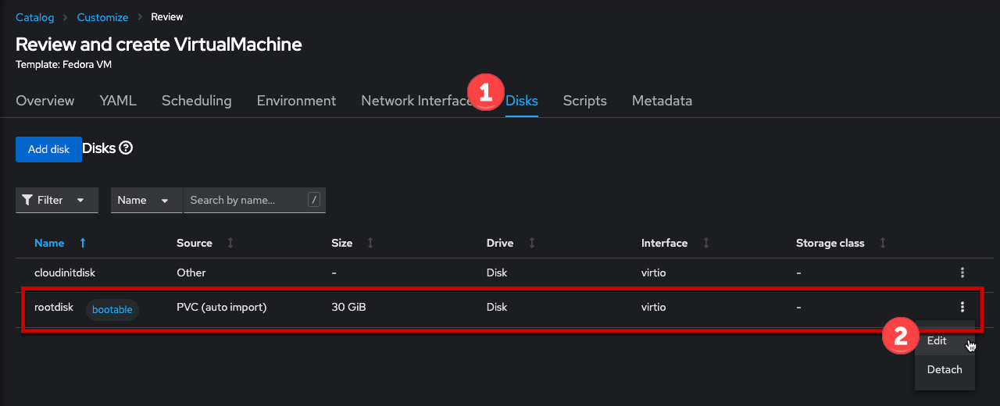
+
The modal has many fields that are used to set the configuration of the disk. For this lab we are only going to change the size of the disk, setting it to be *40 GIB*, then click the *Save* button.
+

+
The other fields control how the disk is created. These include:
+
* Is it a new "empty" disk, cloned from another PVC, or imported from a http(s) or object location
* The type of interface used by the VM for the disk, e.g. the paravirtual `VirtIO` vs a standard virtual SCSI or SATA controller.
* The `StorageClass` used by the PVC. 
* Whether the disk is preallocated, i.e. "thick" provisioned. By default OpenShift Virtualization creates the VM disks as thin provisioned in the PVC.
+
[NOTE]
Preallocating, or not, the VM disk does not affect how the CSI provisioner will create the volume on the backing storage device. Some storage partners will create thin/thick devices based on their own policies, often defined at the storage class level. Be sure to work with your storage team and vendor to determine the optimal setting for your environment.

. Add a toleration for the lab environment taint
+
Move to the *Scheduling* tab for the virtual machine, then - as before - edit the *Tolerations rules*.
+
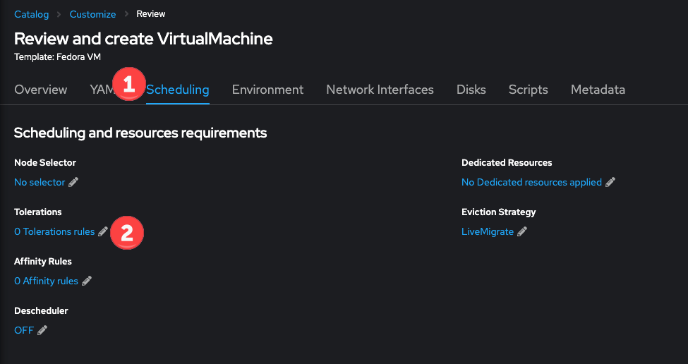
+
In the modal, click the *Add toleration to specify qualifying Nodes* link.
+

+
Add a *Taint key* value of `metal`, leave the *Value* and *Effect* at the defaults. The dialog will update to show that a node matches the toleration. Click *Save* to close the dialog.
+
image::images/modify_edit_toleration_2.png[]

. Use cloud-init to install an application
+ 
This virtual machine will use cloud-init to automatically deploy an application. This is a very simple example which will install nodejs, place a file, and start the application. However, hopefully it sets the stage for understanding how OpenShift Virtualization could be used with existing application dev, test, and deploy operations using the same automation tools used with other virtualization platforms.
+
In addition to installing npm and nodejs, we are also using cloud-init to set a password for the default user `fedora`. Cloud-init is a powerful tool that can be used i.e. to connect your virtual machines to the existing authentication/authorization solution in your environment. This configuration is for lab purposes only and does not reflect best, or suggested, practices.
+
Begin by browsing to the *Scripts* tab, then selecting the *Edit* link for the Cloud-init section.
+
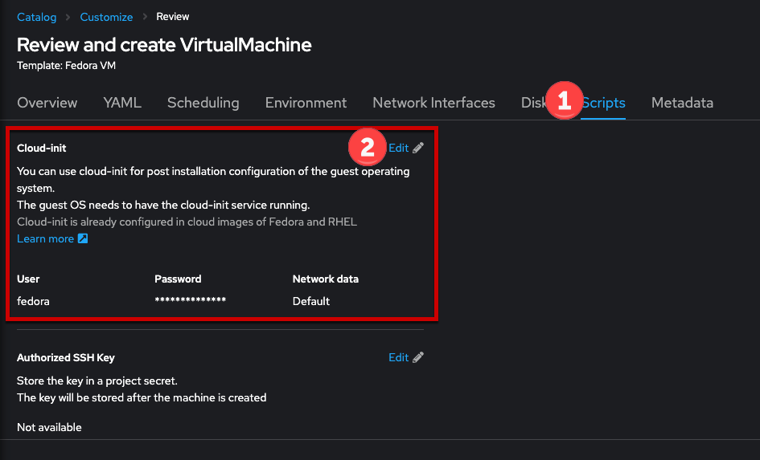
+
In the modal we want to use the *Script* option to provide a custom cloud-init script for the virtual machine. After selecting the *Script* radio button, the modal will change to show some YAML code. Select all of this code and delete it, then copy -> paste the below YAML into the dialog.
+
[source,none,role="copypaste copypaste-warning"]
----
userData: |
  #cloud-config
  user: fedora
  password: rhsummit
  chpasswd:
    expire: false
  packages:
    - nodejs
    - npm
  write_files:
    - content: |
        var os = require('os');

        var express = require('express')
        var app = express()
        
        app.get('/', function (req, res) {
          res.send('Hello from Red Hat Summit, I\'m ' + os.hostname() + '!\n')
        })

        app.listen(3000, function () {
          console.log('listening on port 3000')
        })
      path: /opt/summit/index.js
    - content: |
        #! /usr/bin/bash
        cd /opt/summit
        npm init -y
        npm install express -y
        node index.js
      permissions: '0755'
      path: /opt/summit/start.sh
    - content: |
        [Unit]
        Description=Red Hat Summit
        After=network.target

        [Service]
        User=1000
        Group=1000
        WorkingDirectory=/opt/summit
        ExecStart=/usr/bin/bash /opt/summit/start.sh

        [Install]
        WantedBy=multi-user.target
      path: /etc/systemd/system/summit.service
      permissions: '0755'
  runcmd:
    - chown -R fedora:fedora /opt/summit 
    - systemctl daemon-reload
    - systemctl enable --now summit.service
----
+
Once done, click *Save* then *Apply* to close the dialog.
+

+
In the next lab step we'll walk through how to expose the application just like other OpenShift-hosted applications using a `Service` and `Route`.

. Finally, add a label for the application
+
The label is used to help identify which components support a particular application. It will also be used in the next lab segment for identifying objects for a `Service` definition. Labels are optional, but help with organization and managing resources in OpenShift, including virtual machines.
+
Virtual machines deployed with OpenShift Virtualization consist of two components: 1) the virtual machine definition itself, and 2) when running, a `Pod` wherein the libvirt KVM process is running. For this step, we want to add a label to the `Pod` created when the VM is started, which means we need to edit the YAML definition. 
+
Begin by browsing to the VM's YAML tab. Scroll down to the `spec.template.metadata.labels` section. If you've been following this lab guide, it should be approximately line 127. Add a new line for `app: rhsummit`. When complete, click the *Save* button.
+
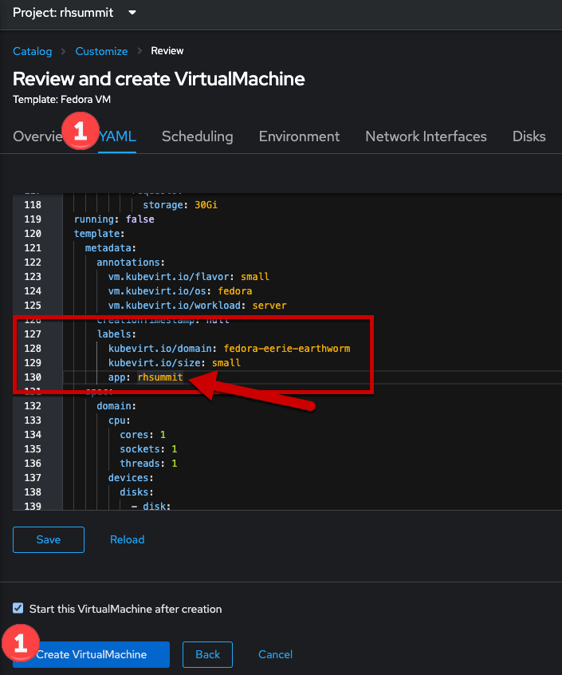
+
[NOTE]
====
This step is _optional_. If you also want to label the VM definition, which is useful for many reasons, then follow these steps.

. Navigate to the *Metadata* tab for the virtual machine customization dialog, then click the *Edit* link for labels.
+

. In the modal, click into the text box and enter `app=rhsummit`. The text will appear in its own bubble if entered correctly. Click out of the dialog and it will convert to looking like the other labels.
+

====

. Click the *Create VirtualMachine* button
+
Ensure the *Start this VirtualMachine after creation* checkbox is checked.
+

+
If the *Start this VirtualMachine after creation* checkbox was not checked, start the virtual machine by selecting the *Actions* drop down, then choosing *Start*.
+
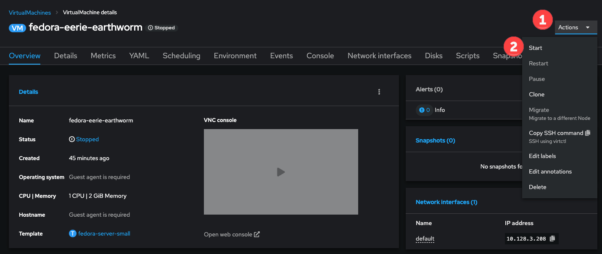

. Login to the VM to verify the configuration
+
This VM will take a bit of extra time after starting for cloud-init to complete the requested actions, however you can still log into the VM once it starts and boots. Once the VM starts, open the console using the tab.
+
Login using the username `fedora` and the password `rhsummit`. This was set in cloud-init and not randomly generated by OpenShift Virtualization. You can also see this info in the GUI.
+
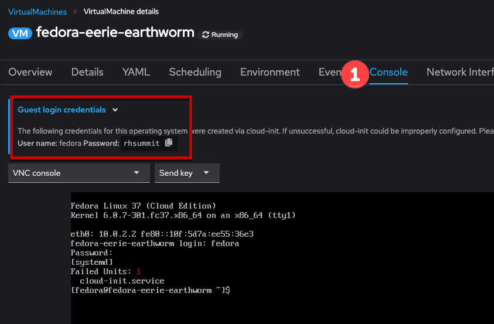
+
[NOTE]
When logging in, if you receive a warning about the cloud-init.service being failed, it's safe to ignore. This is most likely due to cloud-init not being finished yet. 
+
Verify the configuration of the VM was applied using these Linux commands:
+
[source]
----
# to see the size of the disk, which should reflect approx 39 GiB available
df -h /

# to see the number of CPUs assigned to the VM, this should be 2
nproc --all

# to see the amount of memory in the VM, which should be approx 4 GiB
free -ght
----
+

+
To verify that the application was successfully deployed, use the `curl`` command.
+
[source]
----
curl localhost:3000
----
+

== Virtual machine snapshots

Snapshots of virtual machines create a point-in-time recovery objective allowing the VM to be reset back to its state when the snapshot was created. OpenShift Virtualization relies on the CSI storage provider's snapshot capability to create disk snapshots for the virtual machine, which can be taken "online", while the VM is running, or "offline", while the VM is powered off. If the KVM integrations are installed to the VM, you will also have the option of quiesing the guest operating system (quiesing ensures that the snapshot of the disk represents a consistent state of the guest file systems, e.g. buffers are flushed and the journal is consistent).

Since disk snapshots are dependent on the storage implementation, abstracted by CSI, performance impact and capacity used will depend on the storage provider. Work with your storage vendor to determine how the system will manage PVC snapshots and the impact they may, or may not, have.

=== Create a snapshot

. Navigate to the details page for a virtual machine by choosing *Virtualization* -> *VirtualMachines*, then clicking a virtual machine name.
+

. Browse to the *Snapshots* tab, click *Add Snapshot*
+

. In the modal, click *Save*
+
[NOTE]
There is a warning about the `cloudinitdisk` not being included in the snapshot. This is expected and happens because it is an ephemeral disk.
+

+
After clicking *Save*, the snapshot will show in the list. It will briefly show a status of `In Progress` before movign to `Succeeded`.

. View the VM disk snapshot by browsing to *Storage* -> *VolumeSnapshots*
+
The `VolumeSnapshot` will have a source PVC of the virtual machine's disk. If there is more than one disk configured for the VM, then a `VolumeSnapshot` will exist for each one of them.
+
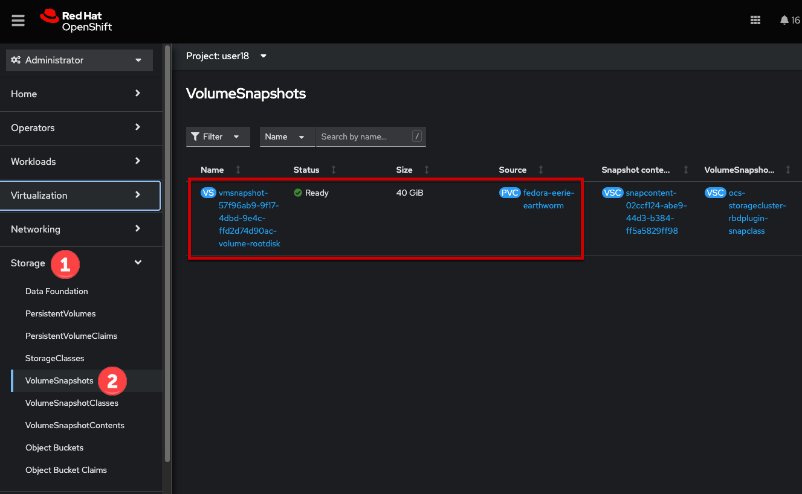

=== Delete a snapshot

. Navigate to the details page for the virtual machine with a snapshot
+

. Browse to the *Snapshots* tab for the virtual machine, for the snapshot, choose *Delete VirtualMachineSnapshot* from the menu.
+

. Click *Delete* in the modal, to confirm the deletion.

== Live migration

Pods are not migrated, they are terminated and rescheduled if they need to leave a node for any reason. For virtual machines, this behavior is not what's expected - we expect a VM to nondisruptively move between nodes! OpenShift Virutalization is no exception to this, the VMs can be live migrated at any time. OpenShift updates, graceful eviction (e.g. due to a soft threshold violation), node maintaince via a cordon + drain operation, or just manually triggering a migration via the GUI, CLI, or programmatically using API (with a standard YAML object) all result in the virtual machine being live migrated as expected.

. Navigate to *Virtualization* -> *VirtualMachines* in the left navigation menu.
+
Make sure you're using the `%username%` project.
+

. For the virtual machine you want to migrate, click the 3-dot menu on the right of the row. Select the *Migrate* option.
+

. Alternatively, view the details for the VM by clicking it's name, then selecting the *Actions* drop down in the upper right, and choosing the *Migrate* option.
+

. A few secnods after clicking *Migrate*, the VM status will change to *Migrating*.
+

. After completing, the VM will return to the running status and the node will be different than before.
+

