:scrollbar:
:toc2:

= Migrate a VM and use it with a containerized application

:numbered:

This segment of the lab will import a virtual machine hosted in a Red Hat Virtualization environment to OpenShift Virtualization using the Migration Toolkit for Virtualization. Like OpenShift Virtualization, the migration toolkits are included with OpenShift.

Once the VM has been imported, we will then connect to it using Kubernetes-native methods - Services and Routes. OpenShift Virtualization is a powerful tool for enabling applications to span both containers and VMs on the same platform, allowing the application team to standardize with the Kubernetes API and automation methods. Applications hosted in virtual machines gain many of the benefits of Kubernetes, while retaining the benefits of being a VM.

Goals:

* Configure the Migration Toolkit for Virtualization
** Create a provider
** Create network and storage mapping
* Import a virtual machine
* Review application modernization options

== Migration Toolkit for Virtualization

There are four migration toolkits:

* https://developers.redhat.com/products/mtr/overview[Migration Toolkit for Runtimes] - Assist and accelerate Java application modernization and migration.
* https://access.redhat.com/documentation/en-us/migration_toolkit_for_applications/[Migration Toolkit for Applications] - Accelerate large-scale application modernization efforts to containers and Kubernetes.
* https://docs.openshift.com/container-platform/4.12/migration_toolkit_for_containers/about-mtc.html[Migration Toolkit for Containers] - Migrate stateful application workloads between OpenShift clusters.
* https://access.redhat.com/documentation/en-us/migration_toolkit_for_virtualization/[Migration Toolkit for Virtualization] - Import virtual machines from Red Hat Virtualization (RHV) and VMware vSphere into OpenShift Virtualization. The ability to migrate from Red Hat OpenStack Platform (RHOSP) and OpenShift Virtualization is available in version 2.4 and later.

This lab uses the Migration Toolkit for Virtualization (MTV) to import a virtual machine from Red Hat Virtualization to OpenShift. The migration toolkit supports two "modes" of import:

* Cold migration turns off the source virtual machine before starting the migration. This is the default migration type.
* Warm migration copies data while the source virtual machine continues to run. Once the bulk of data has been migrated, the VM is shutdown and the final data is copied to the destination. The new VM can then be started, resulting in a much shorter period of downtime for the VM-hosted application.

The migration toolkit has already been deployed to your cluster using the Operator. Documentation for how to install and configure the Operator can be found https://access.redhat.com/documentation/en-us/migration_toolkit_for_virtualization/[here].

If you would like to learn more about how to configure the Migration Toolkit for Virtualization, please see https://access.redhat.com/documentation/en-us/migration_toolkit_for_virtualization/2.4/html/installing_and_using_the_migration_toolkit_for_virtualization/prerequisites#rhv-prerequisites_mtv[here] for documentation with Red Hat Virtualization or https://access.redhat.com/documentation/en-us/migration_toolkit_for_virtualization/2.4/html/installing_and_using_the_migration_toolkit_for_virtualization/prerequisites#vmware-prerequisites_mtv[here] for VMware vSphere.

=== Accessing the Migration Toolkit for Virtualization

. The migration toolkit dashboard can be found in the menu on the left side

. Browse to *Migration*, then click on *Providers for virtualization*
+
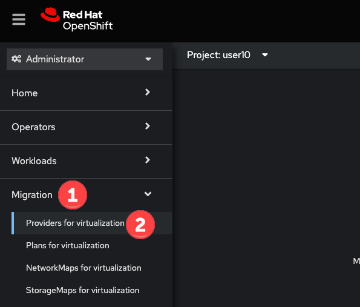

=== Add the provider for the local cluster

Each source and destination is configured as a provider. The imported virtual machine(s) will be hosted by the local cluster, so we first need to add the cluster as a provider.

. After browsing to the *Providers for virtualization* menu option described above, ensure you are in the `%username%`, e.g. `user10` project, and click the *Create Provider* button. If you have not already created the project, do so now.
+
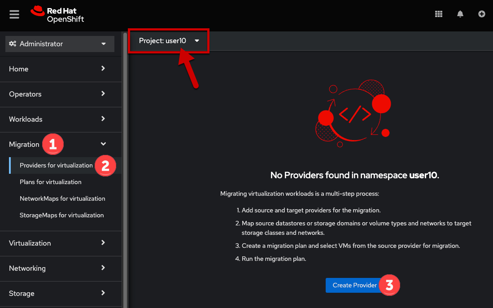

. In the modal, select `OpenShift Virtualization` as the provider type, then complete the remaining fields as described below. Click *Create*.
+
* Provder name: `local`
+
[NOTE]
The API URL and service account token fields must be empty.
+
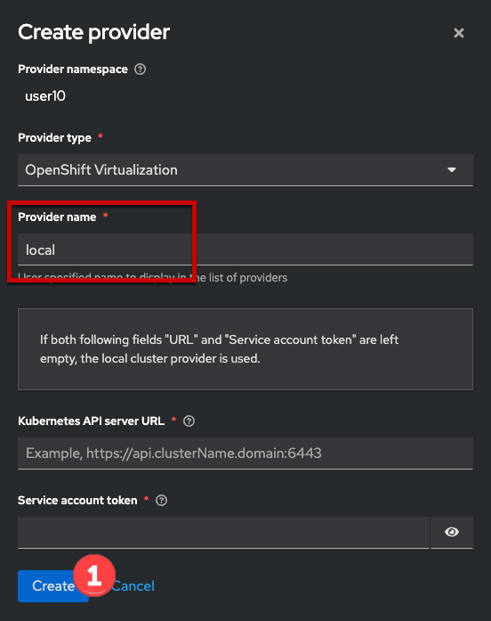

=== Add the RHV provider

The next step to importing virtual machines is to add a source provider. The cluster hosting the Migration Toolkit for Virtualization is already added as a provider, which will be used as the destination.

. From the *Providers* panel, click the *Create provider* button
+
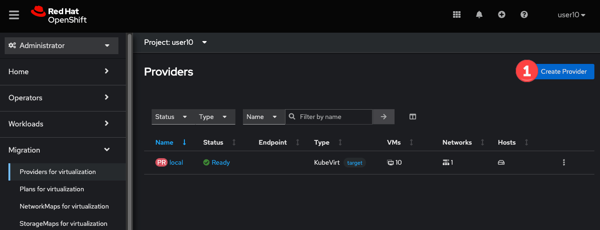

. Select *Red Hat Virtualization* from the provider type drop down, complete the info. When data entry is done, click the *Create* button.
+
* Name: `summit-rhv`
* RHV Manager hostname or IP address: `rhvm.cnv.infra.opentlc.com`
* RHV Manager user name: `%rhv_username%`
* RHV Manager password: `%rhv_password%`
* Check the box for *Skip certificate validation*
+

. Wait for the provider status to go from `Staging` to `Ready`
+

=== Create a network mapping

When importing virtual machines the migration toolkit needs to understand how to map a network used by a source VM to a network available in the destination OpenShift cluster. This step will create a map for this purpose.

[NOTE]
This environment only has one network available, the SDN, however you can configure the cluster to use as many VLAN and other networks as needed for your virtual machines. This is done using the https://docs.openshift.com/container-platform/4.12/networking/k8s_nmstate/k8s-nmstate-about-the-k8s-nmstate-operator.html[NMstate Operator] in OpenShift. See https://docs.openshift.com/container-platform/4.12/virt/virtual_machines/vm_networking/virt-attaching-vm-multiple-networks.html[here] for examples of how to configure bonds, bridges, VLAN interfaces and more to connect your VMs.

. Browse to *NetworkMaps for virtualization* and click *Create NetworkMap*
+
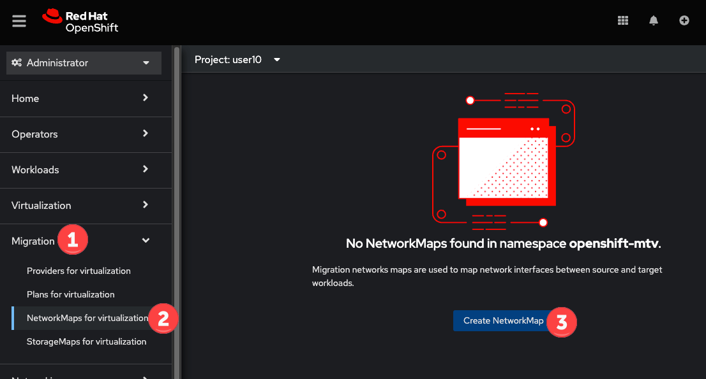

. In the modal, input the values below, click *Create*
+
* Name: `public-to-sdn`
* Source provider: `summit-rhv`. This will match the name given to the provider created in the previous step.
* Target provider: `local`
* Source networks: `Public`
* Target namespaces / networks: `Pod network (default)`
+
The *Source networks* and *Target namespaces / networks* fields will not appear until the other fields have been filled.
+

. The network map will be visible in the list after.
+
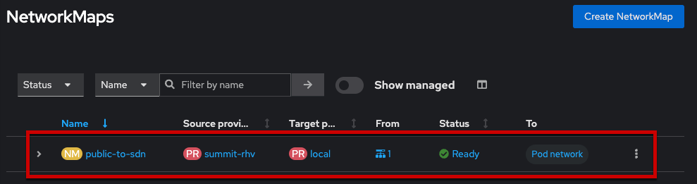

=== Create a storage mapping

Similar to the network mapping, the storage mapping tells the migration toolkit which destination storage class to use for PVCs holding VM disks from specific source storage domains.

[NOTE]
This lab uses https://www.redhat.com/en/technologies/cloud-computing/openshift-data-foundation[OpenShift Data Foundation] (ODF), a Kubernetes-native storage solution that utilizes the storage resources of the OpenShift nodes to create a pool of storage that can be used by Pods and virtual machines. However, OpenShift Virtualization works with any CSI storage provisioner. `ReadWriteMany` PVCs are required for live migration, please work with your storage vendor to understand the configuration and capabilities of the storage device you're using.

. Browse to the *StorageMaps for virtualization* and click *Create StorageMap*
+
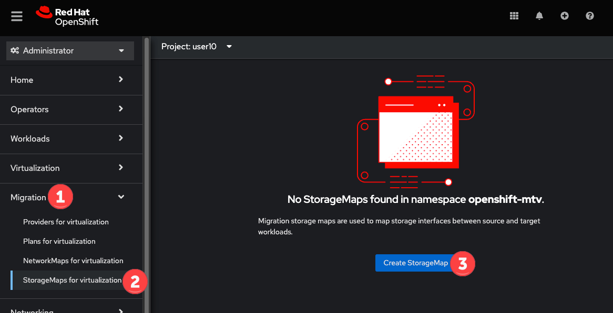

. In the modal, input the values below, click *Create*
+
* Name: `vmstore-to-rbd`
* Source provider: `summit-rhv`. This will match the name given to the provider created in the previous step.
* Target provider: `host`
* Source storage domains: `vmstore00`
* Target storage classes: `ocs-storagecluster-ceph-rbd`
+
As with the network mapping, the last two options will not appear until the other fields are completed.
+

. The storage map will be visible in the list after.
+
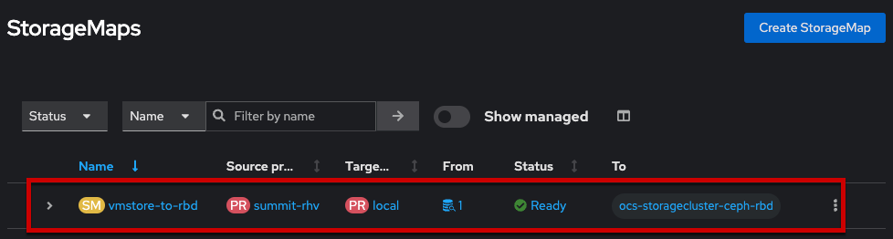

[NOTE]
The above created network and storage mappings allow us now to implement a plan for the migration. The mappings can be re-used for many plans that define the actual migration plan. 

== Migrate a virtual machine

Once the mappings have been created, we can begin to import virtual machines to OpenShift. Migration plans are used to coordinate the movement of *one or more* virtual machines, in parallel or sequentially, from the source hypervisor (here: RHV) to OpenShift.

=== Create a migration plan

. From the navigation menu, browse to *Plans for virtualization*, click the *Create plan* button
+
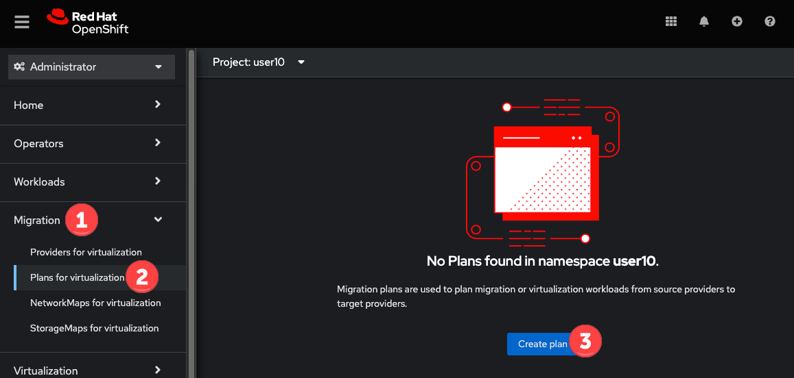

. In the *General* pane, complete the fields. Click *Next* when done.
+
* Plan name: `summit-oracle`
* Source provider: `summit-rhv`
* Target provider: `local`
* Target namespace: your user namespace, `%username%`. If you did not create this namespace in a previous step you can choose a different namespace or cancel the migration plan wizard, create the namespace, then restart this step.
+
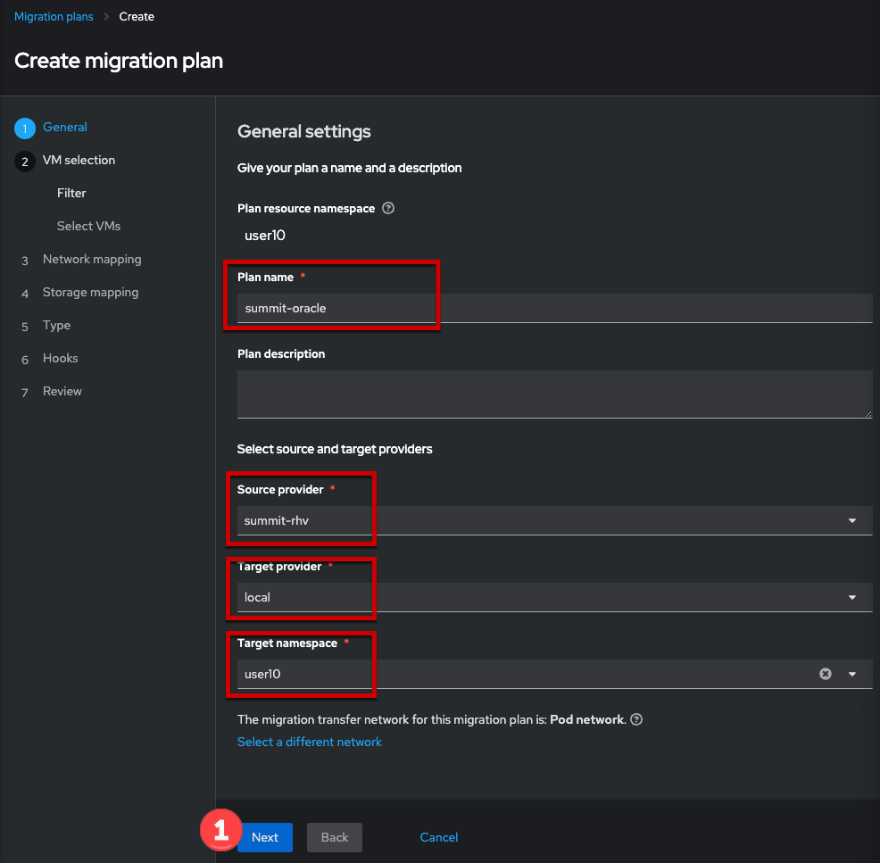

. Check the box for *All datacenters*, click *Next*
+
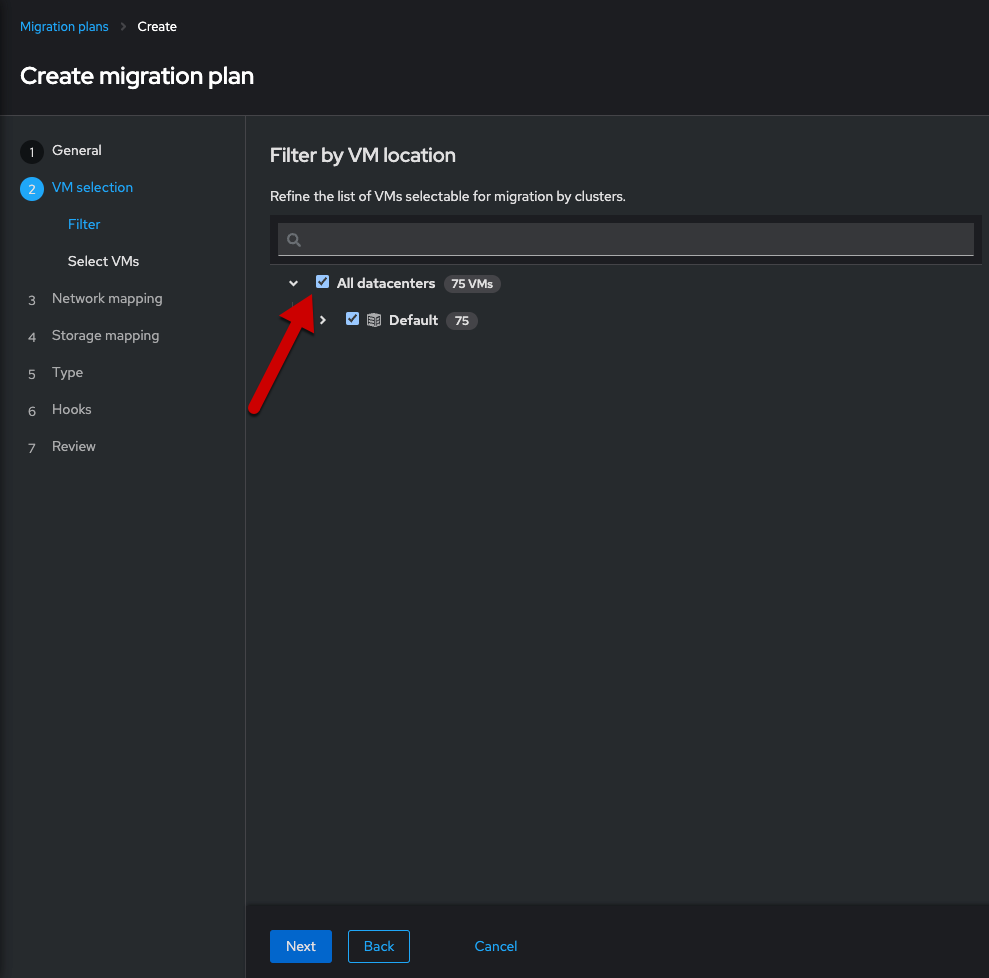

. Select the *oracle-%guid%* virtual machine, click *Next*
+
Filter the VMs by clicking the funnel icon to open the filter prompt, then putting %guid% into the search box and clicking the magnifying glass icon.
+

. Choose the `public-to-sdn` network mapping, click *Next*
+
If you used a different name in the earlier step, choose the option that name here.
+

. Choose the `vmstore-to-rbd` storage mapping, click *Next*
+
If you used a different name in the earlier step, choose the option that name here.
+

. Choose *Cold migration*, click *Next*
+

. Press *Next* on the hooks page
+
Hooks utilize Ansible playbooks to perform actions before or after the migration. For example, reconfiguring the application or infrastructure, e.g. a load balancer, to stop using the virtualized application while it's being migrated.
+
No hooks are needed for this lab, we can move past this step.
+

. Review and click *Finish*
+

=== Start the migration plan to transfer the VM

This step is *optional*. Importing the virtual machine can take 20-40 minutes, or longer, depending on several factors. As a result the lab already has the virtual machine imported to the `retail-user` namespace with the name `oracle-database`.

. After completing the previous step, the migration plan will be visible from the list found under the *Plans for virtualization* menu item. When you're ready, click the *Start* button for the migration plan.
+
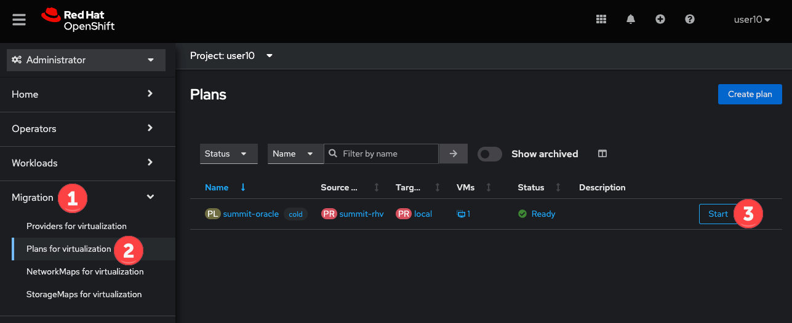

. Confirm the action by pressing *Start* in the modal. 
+
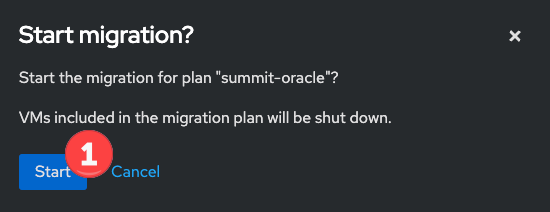

. After pressing the *Start* button, the window will redirect to the migration details screen. After a moment, the plan will change status to `Initialize migration`, followed by `Transfer disks`. To see additional details, expand the item using the carrot to the left of the VM's name.
+

. Wait and watch the transfer progress
+
The import job is running as a Pod in the `%username%` namespace (or whatever namespace you used for the destination). From the OpenShift UI, browse to *Workloads* -> *Pods*, select the Pod with a name starting with `importer-summit-oracle` and view the logs to see the exact status.

[NOTE]
Some changes have been made to the infrastructure supporting the RHV import. The import job _may_ fail. As noted above, this _will not_ affect your ability to complete the lab as the virtual machine is already available in the `retail-user` namespace.

== [OPTIONAL] Application modernization

This lab environment also has the projects, code, and other resources needed to complete the Modern Application Development workshop. This includes VScode and a sample Java application which uses an Oracle database. If you want to learn more about how to configure a container-based application to use the Oracle database running in the VM, please use https://get-a-username-dev-guides.%cluster_subdomain%[this page] to access the lab guide. 

[IMPORTANT]
Use the same username that you've already been assigned, even though the form will give you a different username. The module links for the guide and other information is still correct and accurate.

Alternatively, please attend one of the Modern Application Development workshops offered at Red Hat Summit.