:scrollbar:
:toc2:

= Using Kubernetes features with virtual machines

:numbered:

With OpenShift Virtualization, VMs are native extensions of the Kubernetes API, which means that they can be used, interfaced with, automated, and configured like any other Kubernetes object. This means all of the tools and processes that are used with Kubernetes for configuration management, such as Argo CD (OpenShift GitOps), Tekton (OpenShift Pipelines), and Istio (OpenShift Service Mesh) work with OpenShift Virtualization too.

This segment of the lab will focus on network connectivity in and outside of the OpenShift cluster. We will use the native Kubernetes `Service` to enable discovery of the virtual machine-hosted application and then expose the application externally using an OpenShift `Route`.

If you would like to learn more about using OpenShift Virtualization with other OpenShift features, please see these resources:

* https://cloud.redhat.com/blog/virtual-machines-as-code-with-openshift-gitops-and-openshift-virtualization[Virtual Machines as Code with OpenShift GitOps and OpenShift Virtualization]
* https://cloud.redhat.com/blog/using-red-hat-advanced-cluster-management-and-openshift-gitops-to-manage-openshift-virtualization[Using Red Hat Advanced Cluster Management and OpenShift GitOps to manage OpenShift Virtualization]
https://cloud.redhat.com/blog/how-to-make-sure-custom-boot-source-images-are-automatically-updated[How to Create Automatically Updating Boot Source Images]
* https://cloud.redhat.com/blog/how-to-add-virtual-machines-to-a-service-mesh[How to Add Virtual Machines to a Service Mesh]

Goals:

* Create a `Service` for the virtual machine
* Create and connect to the VM using a `Route`
* Connect to the virtual machine using the SDN
* Control access to the virtual machine using a network policy

[IMPORTANT]
This segment of the lab assumes you have completed the activity _Customizing a VM at creation_ from the "Managing VMs" segment. If you have not completed that activity, you can still use the virtual machine in the `retail-user1` project to create a `Service`, however the remaining steps for verifying the application shown here will not work for that VM.

== Exposing VM-hosted applications using the SDN

Using a `Service` makes container and virtual machine based applications discoverable on the SDN. This makes it easy for other application components to reach them using shortened DNS names instead of tracking a potentially changing SDN IP address. 

. Verify that the application is running as expected by opening the VM console, logging in, and using the command `curl localhost:3000`
+
We are using the virtual machine configured in the lab segment "Customizing a virtual machine at creation". This VM used cloud-init to install NodeJS and a simple page that responds with the VM's hostname. If you have not completed this process, please return to that section of the guide or, for a less complete example, use the `oracle-database` VM in the `retail-user1` namespace.
+
Browse to *Virtualization* -> *VirtualMachines*, ensure you're using the `rhsummit` project, then choose the VM created previously.
+
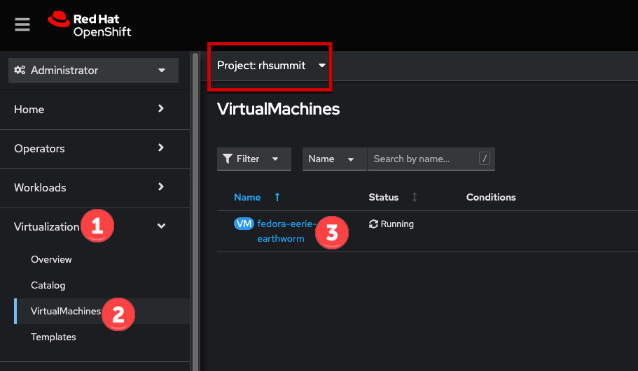
+
The credentials are visible in the OpenShift UI by expanding the "Guest login credentials" segment of the page.
+
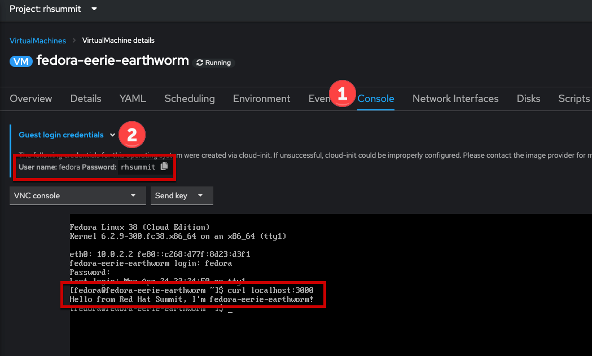

. After verifying the web app is responding, in the left navigation menu browse to *Networking* -> *Services*, ensure you're viewing the `rhsummit` project. Click the *Create Service* button.
+
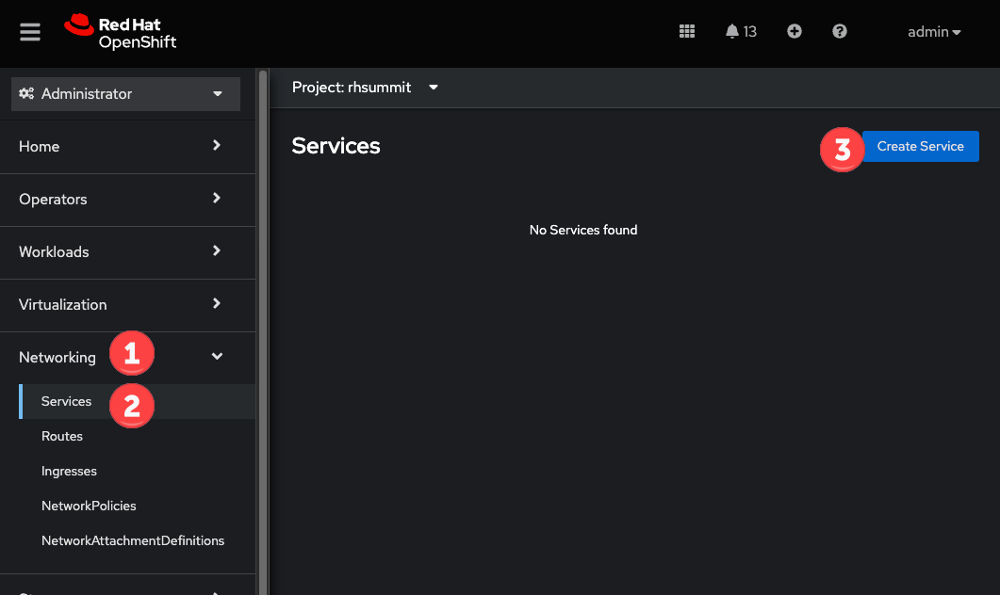

. The `Service` definition is YAML based. Copy/paste the below YAML to create the `Service`. Once done, click the *Create* button.
+
[source]
----
apiVersion: v1
kind: Service
metadata:
  name: summit-lab
  namespace: rhsummit
spec:
  selector:
    app: rhsummit
  ports:
    - protocol: TCP
      port: 80
      targetPort: 3000
----
+
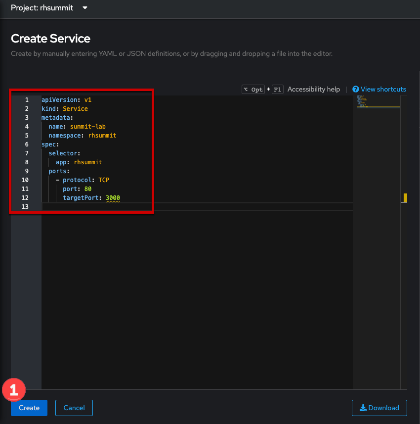
+
[TIP]
====
This section of the lab guide creates a `Service` using the `app` label which was added to the virtual machine definition during creation. This is extremely useful when you expect to have more than one VM or Pod match the label. For example, today there are three instances of the application running in three VMs that you want clients to connect to. In the future, you may begin to transition the service to be natively containerized and deployed using Pods. The same `Service` definition will match those Pods and begin to direct traffic to them just like with the VM today. As VMs and/or Pods are deployed, or removed, the `Service` automatically updates to send traffic, or not, to those endpoints.

However, if you expect to only use the virtual machine with this `Service`, you can also use the VM's name label. In the example used in this lab guide, it would be `vm.kubevirt.io/name: fedora-eerie-earthworm`, which you can see from the VM's details tab.
====

. After creating the `Service`, the summary screen will be shown. Click the link under the *Pod selector* section to view any pods which match.
+
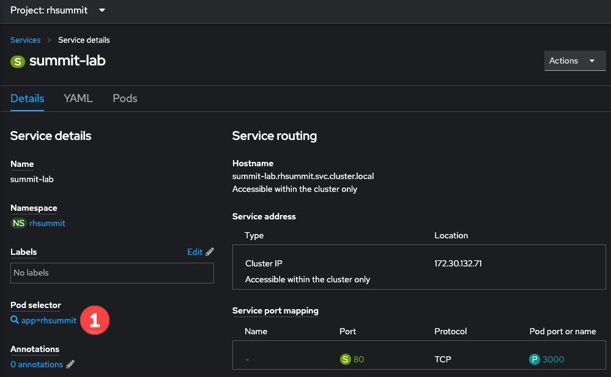
+
The `virt-launcher` pod for the virtual machine will match the selector.
+
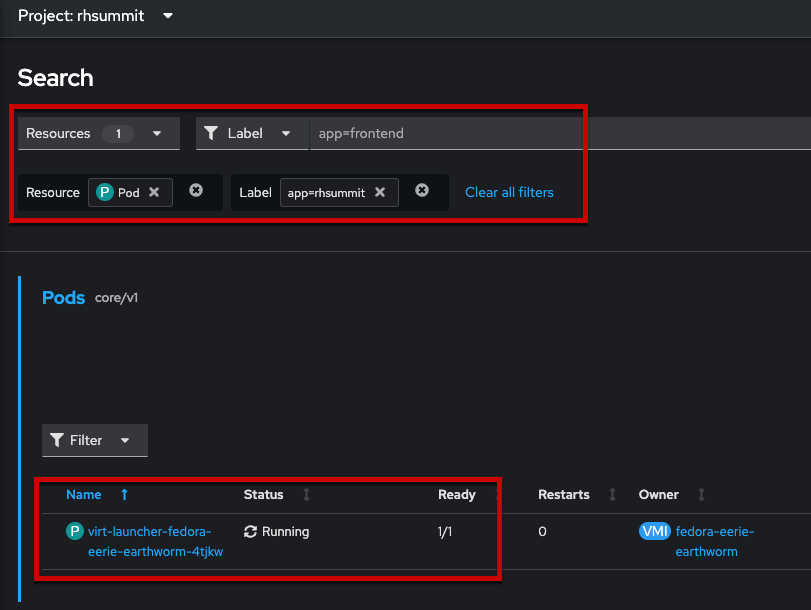

== Connecting to VM-hosted applications externally

With a `Service` matching the virtual machine created, we can define a `Route` to enable external access to the application.

. Begin by browsing to *Networking* -> *Routes* in the left navigation menu. Click the *Create Route* button.
+
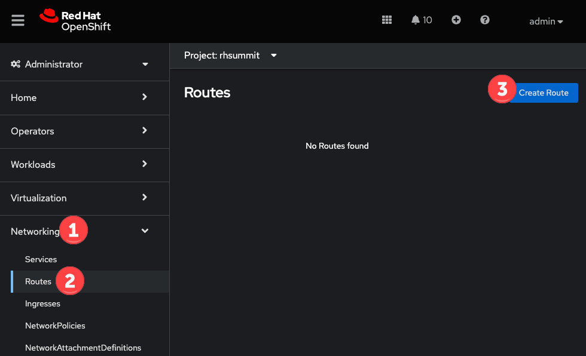

. In the form, complete the following fields, then click *Create*
+
* Name: `hello-summit`
* Service: choose `summit-lab`
* Target port: choose `80 -> 3000 (TCO)`
+
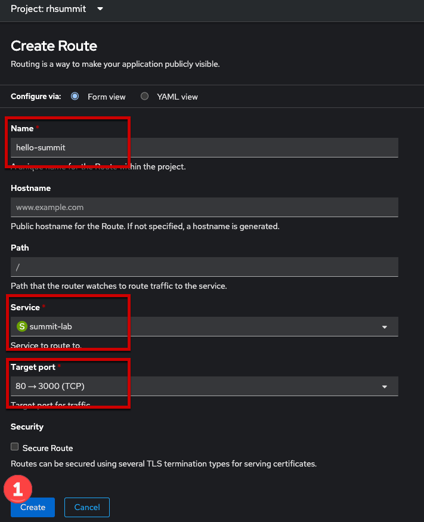

. The summary page will have a link to the external URL under the *Location*. Click the link to view the application.
+
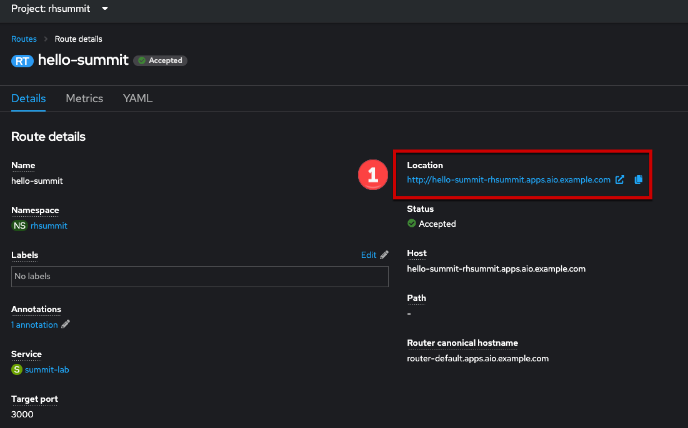
+
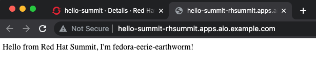

== Connecting to VM-hosted applications within OpenShift

A `Service` allows the Pods and VMs identified by the selector to be quickly and easily consumed by any other Pod or VM in the cluster, while the `Route` enables access from external to the cluster. Let's use a VM from a different project to connect to the VM deployed for Red Hat Summit.

. In the left navigation pane, browse to *Virtualization* -> *VirtualMachines*, then change to the `retail-user1` project. A virtual machine named `oracle-database` has already been created.
+
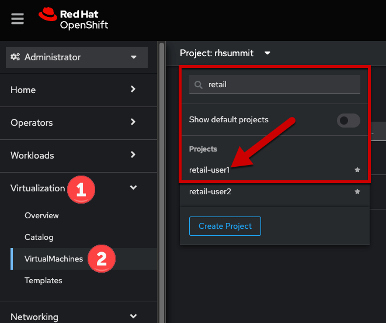
+
Click the name of the VM to display the details page.
+
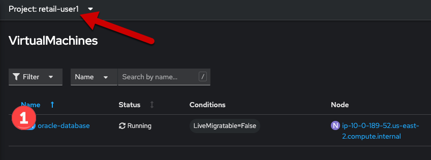

. Switch to the *Console* tab, log into the guest OS using these credentials.
+
----
username: lab-user
password: r3dh4t1!
----
+
[IMPORTANT]
The guest OS was not configured using cloud-init from OpenShift Virtualization, therefore the login credentials are not visible in the web interface.
+
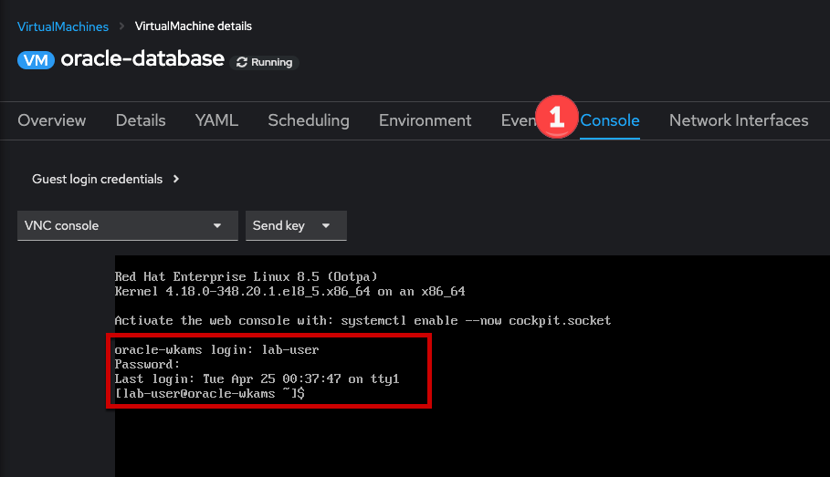

. Verify connectivity to the VM created for Red Hat Summit using a `curl` command against the fully qualified `Service` name.
+
====
curl summit-lab.rhsummit.svc.cluster.local
====
+
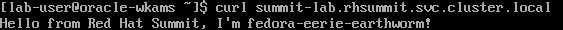
+
[IMPORTANT]
====
If you receive an error about the hostname not being resolved, this is because the guest OS was not reconfigured for the SDN after being imported. You can temporarily fix this with the following command:
[source]
----
cat << EOF | sudo tee /etc/resolv.conf
search svc.cluster.local cluster.local aio.example.com
nameserver 172.30.0.10
options ndots:5
EOF
----
====

== Manage connectivity using a `NetworkPolicy`

The previous section showed how we can use the `Service` name to quickly find and connect to applications hosted in VMs or Pods across the SDN. In this section of the lab we will use a `NetworkPolicy` to block traffic between the VMs. This provides a powerful platform-based tool for managing connectivity between OpenShift-hosted applications, giving the administrator, along with the security and application teams, fine grained control over connection policies that don't rely on guest OS firewall configuration and can be managed using the same tools and methodologies as the rest of the Kubernetes-based application.

. Create a network policy to block traffic from the `retail-user1` project accessing the `rhsummit` project. Browse to *Networking* -> *NetworkPolicies*, switch to the *rhsummit* project, then click *Create NetworkPolicy*
+
* Policy name: `retail-ingress`
* Click the *Add ingress rule* button
* Click the *Add allowed source* button, select the *Allow pods from the same namespace* option.
* Click the *Create* button
+
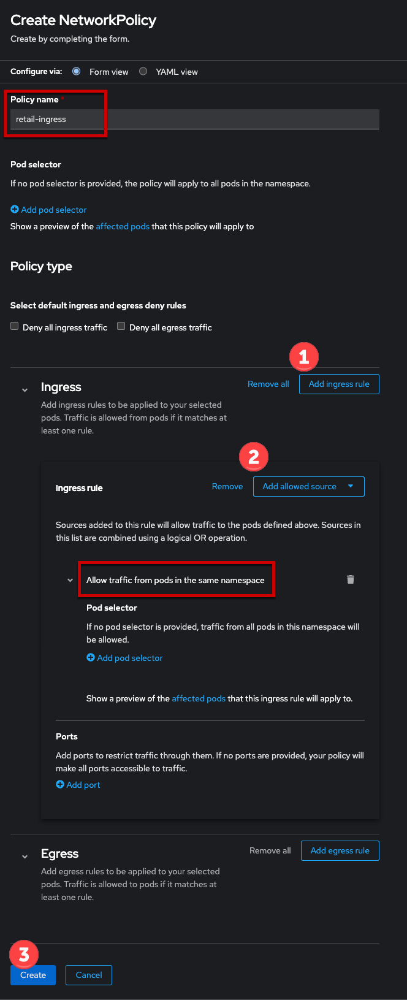

. Return to the `oracle-database` VM in the `retail-user1` project. Open the console and login again if needed. Repeat the `curl` command from the previous activity to test connectivity. This time the connection is not permitted and will result in the `curl` command timing out.
+
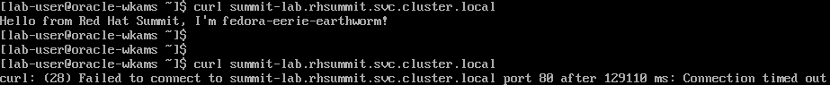
+
Additionally, if you reopen the `Route` created above, the application will not respond. Instead the default "Application is not available" error message is displayed.
+
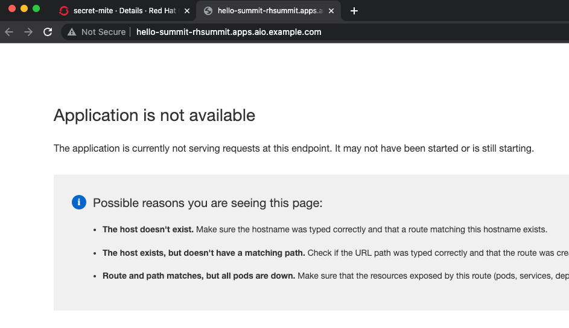

